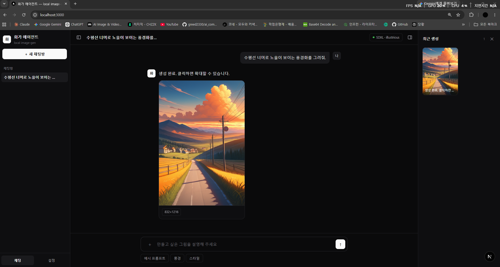
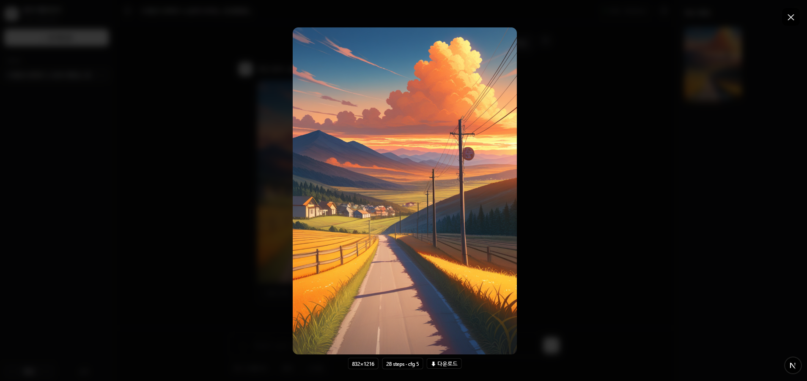

# image-gen-agent

한국어 자연어 입력만으로 ComfyUI 기반 고품질 이미지를 생성하는 로컬 AI 오케스트레이션 파이프라인.

| 채팅 UI | 생성 결과 |
|---------|----------|
|  |  |

"GPT 이미지 생성"처럼 복잡한 프롬프트·설정 없이, 한국어로 원하는 이미지를 설명하면 자동으로 생성해줍니다.  
모든 처리는 로컬에서 이루어지며 외부 서버 전송 없음.

---

## 시스템 요구사항

| 항목 | 최소 |
|------|------|
| GPU | NVIDIA RTX (VRAM **16GB 이상** 권장) |
| Python | 3.11 이상 |
| Node.js | 18 이상 |
| CUDA | 12.4 이상 |
| OS | Windows 10/11 |

> VRAM이 부족하면 LLM↔이미지 모델 간 동적 언로드가 동작하지 않을 수 있습니다.

---

## 사전 준비

### 1. ComfyUI 설치

ComfyUI가 `E:\ComfyUI`에 설치되어 있어야 합니다.  
다른 경로에 설치했다면 `start-all.bat`과 `backend/.env`의 경로를 수정하세요.

```
E:\ComfyUI\
  ├── main.py
  ├── venv\          ← ComfyUI 자체 venv
  ├── models\
  │   ├── checkpoints\   ← SDXL / Flux / Chroma 등 이미지 모델 (.safetensors)
  │   └── ...
  └── output\        ← 생성 이미지 저장 경로 (COMFYUI_OUTPUT_DIR와 일치해야 함)
```

이미지 모델은 [CivitAI](https://civitai.com) 또는 [Hugging Face](https://huggingface.co)에서 받아  
`E:\ComfyUI\models\checkpoints\`에 넣으세요.

---

### 2. Ollama 설치 및 모델 다운로드

[ollama.com](https://ollama.com)에서 Ollama를 설치한 뒤, 아래 명령어로 필요한 모델을 받으세요.

```bash
# 메인 LLM (인텐트 파싱 · 프롬프트 컴파일)
ollama pull qwen3:14b

# 빠른 응답용 경량 LLM
ollama pull qwen3:4b

# 비검열 LLM (NSFW 요청 처리)
ollama pull huihui_ai/qwen3-abliterated:14b

# 멀티모달 LLM (이미지 참조 분석용)
ollama pull huihui_ai/qwen3-vl-abliterated:8b

# 임베딩 모델 (메모리 검색용)
ollama pull nomic-embed-text
```

> 전체 용량 약 **30~40GB**. 필요한 기능에 따라 일부만 받아도 됩니다.  
> SFW만 사용한다면 `huihui_ai` 모델은 생략 가능.

---

## 설치

### 3. 레포지토리 클론

```bash
git clone https://github.com/greed2330/image-gen-agent.git
cd image-gen-agent
```

---

### 4. 백엔드 설정

```bash
cd backend

# 가상환경 생성 및 활성화
python -m venv .venv
.venv\Scripts\activate

# PyTorch (CUDA 12.4) — 반드시 아래 명령어로 따로 설치
pip install torch==2.6.0 --index-url https://download.pytorch.org/whl/cu124

# 나머지 의존성
pip install -r requirements.txt

# 환경변수 파일 생성
copy .env.example .env
```

`.env`를 열어 경로와 모델명이 환경에 맞는지 확인하세요.  
특히 `COMFYUI_OUTPUT_DIR`, `COMFYUI_INPUT_DIR`는 실제 ComfyUI 설치 경로와 일치해야 합니다.

---

### 5. 프론트엔드 설정

```bash
cd frontend
npm install
```

---

## 실행

모든 준비가 끝나면 루트 디렉토리의 배치 파일을 실행합니다.

```
start-all.bat
```

창 4개가 차례로 열립니다:

| 창 | 역할 | 주소 |
|----|------|------|
| ollama | LLM 서버 | `http://localhost:11434` |
| ComfyUI | 이미지 생성 엔진 | `http://localhost:8188` |
| backend | FastAPI API 서버 | `http://localhost:8000` |
| frontend | Next.js UI | `http://localhost:3000` |

ComfyUI 창에서 모델 로딩이 완료되면 `http://localhost:3000`을 브라우저에서 열어 사용합니다.

> **health check**: 백엔드가 정상 기동되면 `http://localhost:8000/health`에서 응답을 확인할 수 있습니다.

---

## 기술 스택

| 레이어 | 기술 |
|--------|------|
| 백엔드 | Python 3.11 · FastAPI · Uvicorn |
| AI 파이프라인 | Ollama (Qwen3) · TIPO-500M · ComfyUI |
| 프론트엔드 | Next.js 16 · React 19 · TypeScript |
| 데이터 | SQLite (SQLModel) · WebSocket |
| 인프라 | 완전 로컬 · RTX 4070 Ti SUPER (VRAM 16GB) |

---

## 파이프라인 구조

```
사용자 한국어 입력
    ↓
① 인텐트 파싱        — 요청 의도 분류 (txt2img / img2img / 설정 변경 등)
    ↓
② 워크플로우 라우팅  — 적절한 ComfyUI 워크플로우 선택
    ↓
③ 프롬프트 컴파일    — TIPO로 danbooru 태그 확장
    ↓
④ 파라미터 해석      — 스텝 수 · 해상도 · LoRA 등 파라미터 결정
    ↓
⑤ ComfyUI 제출       — API로 이미지 생성 요청
    ↓
⑥ Critic 자기평가    — 결과 품질 판단, 기준 미달 시 재시도
```
